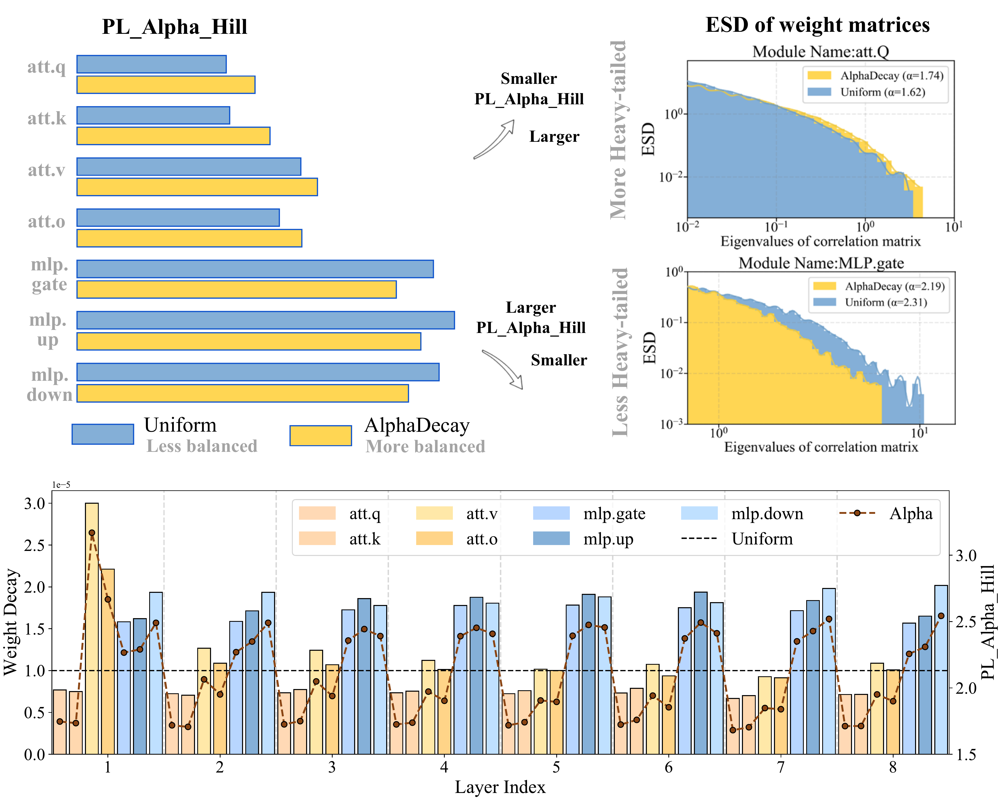

# [AlphaDecay: Module-wise Weight Decay for Heavy-Tailed Balancing in LLMs](https://export.arxiv.org/abs/2506.14562)

This repo contains the pre-release version of AlphaDecay algorithm, proposed by [AlphaDecay: Module-wise Weight Decay for Heavy-Tailed Balancing in LLMs](https://export.arxiv.org/abs/2506.14562).  

AlphaDecay determines the weight decay parameter values of each module in LLM training through the spectral characteristics of the ESD distribution and makes dynamic adjustments during the training process, thereby improving the training performance of the model.

<div align="center">
  
</div>

## Abstract

Weight decay is a standard regularization technique for training large language models (LLMs).  While it is common to assign a uniform decay rate to every layer, this approach overlooks the structural diversity of LLMs and the varying spectral properties across modules. In this paper, we introduce AlphaDecay, a simple yet effective method that adaptively assigns different weight decay strengths to each module of an LLM.  Our approach is guided by Heavy-Tailed Self-Regularization (HT-SR) theory, which analyzes the empirical spectral density (ESD) of weight correlation matrices to quantify “heavy-tailedness.”  Modules exhibiting more pronounced heavy-tailed ESDs, reflecting stronger feature learning, are assigned weaker decay, while modules with lighter-tailed spectra receive stronger decay.  Our method leverages tailored weight decay assignments to balance the module-wise differences in spectral properties, leading to improved performance.  Extensive pre-training tasks with various model sizes from 60M to 1B demonstrate that AlphaDecay achieves better perplexity and generalization than conventional uniform decay and other adaptive decay baselines. 


## Results 


> **(Main result).** Comparison with various weight decay scheduling strategies using Adam optimizer on pre-training various sizes of LLaMa models on C4 dataset. Validation perplexity ($\downarrow$) is reported. All baselines are carefully tuned. 'WD=0' indicates that weight decay is disabled during model training.

|                         | **LLaMa-60M** |         |         | **LLaMa-135M** |         |         | **LLaMa-350M** |         |         | **LLaMa-1B**   |         |         |
|-------------------------|:-------------:|:-------:|:-------:|:--------------:|:-------:|:-------:|:--------------:|:-------:|:-------:|:--------------:|:-------:|:-------:|
| **Weight Decay**        | 1e-5          | 5e-6    | 1e-6    | 1e-5           | 5e-6    | 1e-6    | 1e-5           | 5e-6    | 1e-6    | 1e-5           | 5e-6    | 1e-6    |
| WD=0                    |               | 33.23   |         |                | 24.60   |         |                | 18.62   |         |                | 16.11   |         |
| `Uniform`               | 32.39         | 32.56   | 33.03   | 22.99          | 23.14   | 24.14   | 17.12          | 16.74   | 17.50   | 15.36          | 14.66   | 15.03   |
| `AWD` [1]               | 33.78         | 33.74   | 33.74   | 24.25          | 24.45   | 24.53   | 18.32          | 18.55   | 18.79   | 16.03          | 16.22   | 16.38   |
| `Adadecay` [2]          | 32.24         | 32.52   | 33.03   | 23.20          | 23.08   | 23.96   | 18.21          | 17.42   | 17.91   | 17.23          | 18.14   | 15.35   |
| **{\method}**           | **31.56**     | **31.58**| **32.61** | **22.76**     | **22.55**| **23.49**| **17.00**    | **16.66**| **16.88**| **15.13**    | **14.55**| **14.63**|

- [1] AWD: Ghiasi et al., 2023 ([arxiv link](https://arxiv.org/abs/2210.00094))
- [2] Adadecay: Nakamura et al., 2019 ([arxiv link](https://arxiv.org/pdf/1907.08931))

> **(AdamW.)** Comparison of various weight decay scheduling strategies using AdamW optimizer for pre-training LLaMa-60M and LLaMa-130M models under different weight decay values. Validation perplexity ($\downarrow$) on the C4 dataset is reported. All baselines are carefully tuned. 'WD=0' indicates that weight decay is disabled during model training.

|                    | **LLaMa-60M** |          |          | **LLaMa-135M** |          |          |
|--------------------|:-------------:|:--------:|:--------:|:--------------:|:--------:|:--------:|
| **Weight Decay**   | 0.1           | 0.05     | 0.01     | 0.1            | 0.05     | 0.01     |
| WD=0               |               | 32.73    |          |                | 24.39    |          |
| `Uniform`          | 31.95         | 32.31    | 32.66    | 23.32          | 23.81    | 24.28    |
| `AWD`              | 32.58         | 32.67    | 32.67    | 24.30          | 24.35    | 24.41    |
| `Adadecay`         | 31.88         | 32.25    | 32.58    | 23.18          | 23.62    | 24.21    |
| **`AlphaDecay`**   | **31.20**     | **31.65**| **32.45**| **22.66**      | **23.04**| **23.98**|


> **(ViT Evaluation.)** Comparison of various weight decay scheduling strategies using the Adam optimizer for training ViT-tiny on ImageNet-1K under different weight decay values. Top-1 accuracy ($\%$) is reported on the ImageNet-1K validation set. All baselines are carefully tuned.

| Weight Decay | `Uniform` | `AWD`  | `AdaDecay` | `AlphaDecay` |
|:------------:|:---------:|:------:|:----------:|:------------:|
| 0            | \multicolumn{4}{c}{65.12}         |
| 5e-6         | 66.97     | 65.21  | 65.86      | **67.40**    |
| 1e-6         | 66.41     | 64.98  | 66.26      | **67.73**    |


## Quick Start

### Setup

Our repository is built on top of [Galore](https://github.com/jiaweizzhao/GaLore) and [ConvNeXt](https://github.com/jiaweizzhao/GaLore). You can configure the environment using the following command lines:
```bash
conda create -n alphadecay python=3.9 -y
conda activate alphadecay
conda install -r requirements
```

### Prepare Dataset

We utilized the publicly available C4 dataset and ImageNet-1K dataset, both of which can be accessed and downloaded from their respective official websites.

#### Pretraining LLama-130M on C4
```bash
torchrun --nproc_per_node=2 --master_port=20301 --master_addr=localhost torchrun_main.py \
    --model_config configs/llama_130m.json \
    --optimizer adam \
    --seed 5 \
    --lr 0.001 \
    --batch_size 256 \
    --total_batch_size 512 \
    --num_training_steps 20000 \
    --warmup_steps 2000 \
    --weight_decay 0.00001 \
    --use_modulewise_wd \
    --alpha_positively_with_WD \
    --unbalancedWD_every 500 \
    --esd_metric_for_tb alpha \
    --assign_func tb_linear_map\
    --wd_min_ratio 0.6666 \
    --wd_max_ratio 3 \
    --dtype bfloat16 \
    --eval_every 1000 \
    --wandb_name ours-adam-1.5-3unb-130M-lr0.001-WD0.00001-repeat1 \
    --target_eval_tokens 10_000_000 \
    --save_every 10000
```
#### Pretraining ViT-tiny on Imagenet-1K
```bash
torchrun --nproc_per_node=2 --master_port=20023 --master_addr=localhost main.py \
    --model vit_deit_tiny_patch16_224 \
    --drop_path 0.1 \
    --batch_size 192 \
    --lr 4e-3 \
    --weight_decay 0.000005 \
    --use_modulewise_wd \
    --alpha_positively_with_WD \
    --unbalancedWD_every 500 \
    --esd_metric_for_tb alpha \
    --assign_func tb_linear_map\
    --wd_min_ratio 0.6666 \
    --wd_max_ratio 3 \
    --update_freq 1 \
    --model_ema true \
    --model_ema_eval true \
    --data_path /home/hedi/ImageNet \
    --output_dir /home/hedi/LLM/ViT-awd/outputs \
    --wandb_name vit_deit_tiny_patch16_224-Ours-WD0.000005-1.5-5unb
```

### Acknowledgement
This repository is build upon the [Galore](https://github.com/jiaweizzhao/GaLore) and [ConvNeXt](https://github.com/jiaweizzhao/GaLore) repositories. Thanks for their great work!

## Citation
if you find this repo is helpful, please cite

```
@article{he2025alphadecay,
  title={AlphaDecay: Module-wise Weight Decay for Heavy-Tailed Balancing in LLMs},
  author={He, Di and Jaiswal, Ajay and Tu, Songjun and Shen, Li and Yuan, Ganzhao and Liu, Shiwei and Yin, Lu},
  journal={arXiv preprint arXiv:2506.14562},
  year={2025}
}
```
